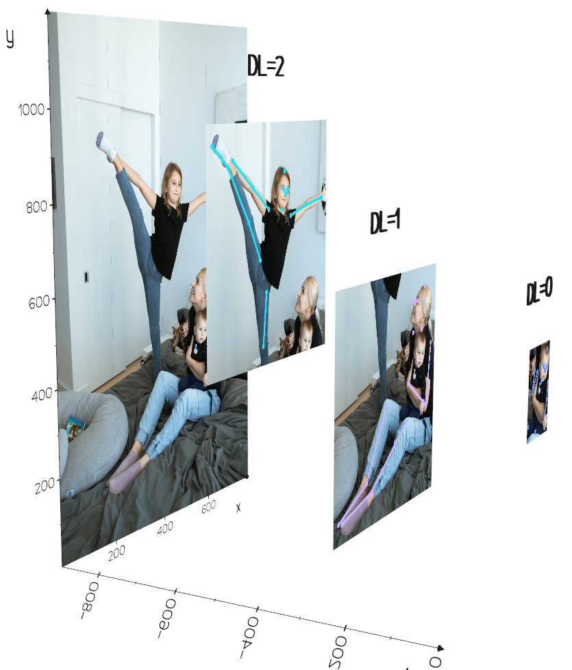
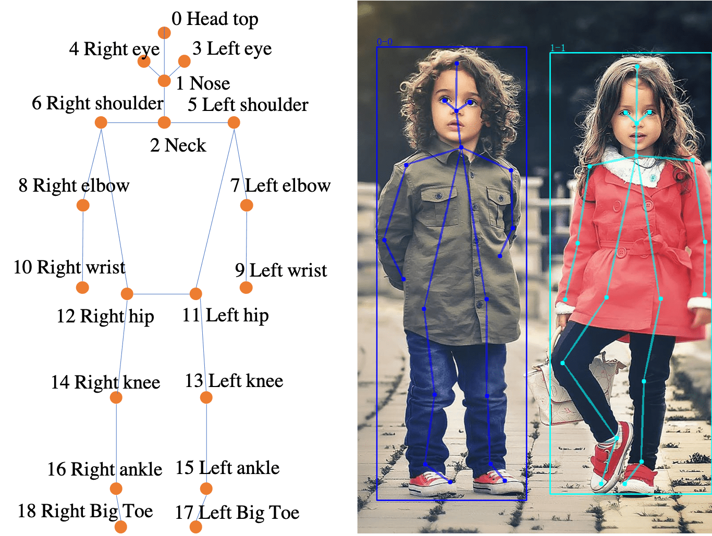
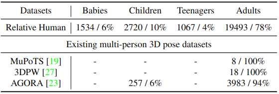

<h1 align="center"> 
  
</h1>

Relative Human (RH) contains **multi-person in-the-wild** RGB images with rich human annotations, including:  
 - **Depth layers:** relative depth relationship/ordering between all people in the image.  
 - **Age group classfication:** adults, teenagers, kids, babies.  
 - Others: **Genders**, **Bounding box**, **2D pose**.  

<p float="center">
  
  
</p>

RH is introduced in CVPR 2022 paper [Putting People in their Place: Monocular Regression of 3D People in Depth](https://arxiv.org/abs/2112.08274).

## Download

|[Google drive](https://drive.google.com/drive/folders/1mkUI8p7PMUgvBDilRvN01rD1rxCdqPHC?usp=sharing)|  
|[Baidu drive](https://pan.baidu.com/s/12z2rNU-Sex-LvS7AaV_Mfg?pwd=r3vh)|

## Leaderboard

See [Leaderboard](https://paperswithcode.com/sota/3d-depth-estimation-on-relative-human).

## Why do we need RH?

<p float="center">
  
</p>

Existing 3D datasets are poor in diversity of age and multi-person scenories. In contrast, RH contains richer subjects with explicit age annotations in the wild. We hope that RH can promote relative research, such as monocular depth reasoning, baby / child pose estimation, and so on. 

## How to use it?

We provide a toolbox for [data loading, visualization](demo.py), and [evaluation](RH_evaluation/evaluation.py). 

To run the demo code, please download the data and set the dataset_dir in [demo code](demo.py).

To use it for training, please refer to [BEV](https://github.com/Arthur151/ROMP) for details.

## Re-implementation

To re-implement RH results (in Tab. 1 of BEV paper), please first download the predictions from [here](https://github.com/Arthur151/Relative_Human/releases/download/Predictions/all_results.zip), then 
```
cd Relative_Human/
# BEV / ROMP / CRMH : set the path of downloaded results (.npz) in RH_evaluation/evaluation.py, then run
python -m RH_evaluation.evaluation

cd RH_evaluation/
# 3DMPPE: set the paths in eval_3DMPPE_RH_results.py and then run
python eval_3DMPPE_RH_results.py
# SMAP: set the paths in eval_SMAP_RH_results.py and then run
python eval_SMAP_RH_results.py
```

## Citation
Please cite our paper if you use RH in your research. 
```bibtex
@InProceedings{sun2022BEV,
author = {Sun, Yu and Liu, Wu and Bao, Qian and Fu, Yili and Mei, Tao and Black, Michael J},
title = {Putting People in their Place: Monocular Regression of 3D People in Depth},
booktitle = {CVPR},
year = {2022}
}
```
